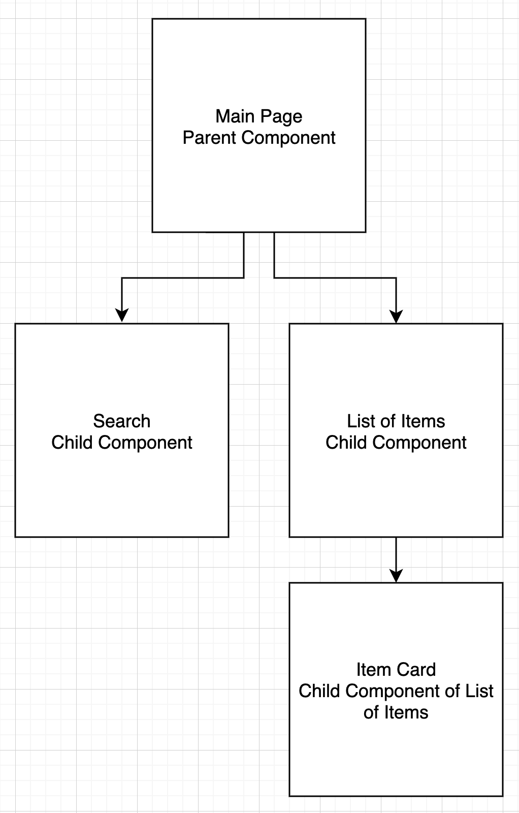

# Brief

## Preparation

Clone the [lesson repo](https://github.com/su-ntu-ctp/6m-software-2.8-uni-data-flow.git) from GitHub. Change to the `app` folder copy the `begin` sub-folder into a working folder, e.g. `work`. Change into your work folder and start the React app.

```
cd work
npm start
```
The starting code is basically the same code we saw earlier, with an additional input field and a `Add Product` button at the bottom of the page. We will create the necessary handlers to add our customised products.

## Lesson Overview

For this session, we will continue where we left off with passing functions as props and diving deeper into how React components are connected and further addinng more features into our app.

A good practice when designing React components is to generalise them into two categories of components:

- Presentational
- Container

### Presentational Components

Presentational components are only concerned with rendering the view according to a styling and data passed to them. They rely on props for their data, but do not have direct access to data stores. They are sometimes known as *dumb components*.

- Concerned about how data looks
- Have their own styles
- Do not change props (immutable)
- Rarely have their own state

### Container Components

Containers contain the business logic of the application. They can make API calls, do processing, compute values, etc. They usually depend on presentational components to show their data. Also known as *smart components*.

- Concerned about how things work
- Uses states to serve data sources
- Provides data to presentational components



## Part 1: Refactor the Code

Containers: Product


Presentational: Input, Button, **Card**, **ViewList**


